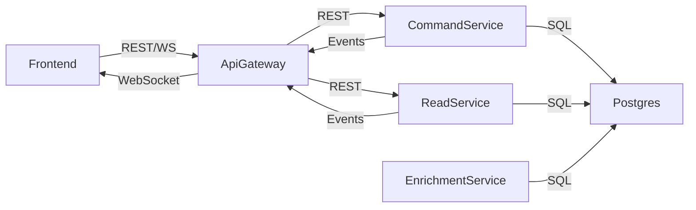
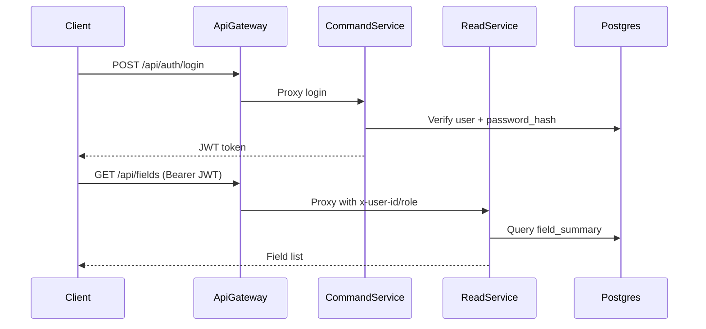

# Architecture

FieldFlow uses a service-oriented architecture with a thin API gateway in front of dedicated read and command services, a PostGIS-backed database, and a realtime event fan-out for UI updates.

## Components
- **Frontend (Next.js)**: UI that talks to the gateway for REST APIs and WebSocket events.
- **API Gateway (Express + http-proxy-middleware)**: Routes requests to read/command services, enforces JWT auth, and broadcasts realtime events.
- **Command Service (Express)**: Write APIs for fields, soil, weather, and analysis. Emits events to the gateway.
- **Read Service (Express)**: Read APIs for fields, dashboards, notifications, and geo queries (PostGIS).
- **Enrichment Service (Worker)**: Polls the `events` table for `FIELD_CREATED` and writes initial AI analysis.
- **PostgreSQL + PostGIS**: Primary data store with geospatial indexing and an event-sourcing table.

## Component Diagram

## Data Model Overview
Key tables (see `infra/postgres/init.sql`):
- `users`: auth identity, role, metadata.
- `fields`: core entity, includes `location` geography and optional `boundary`.
- `soil_data`, `weather_data`: time-series field telemetry.
- `ai_analysis`: analysis outputs (manual or enrichment).
- `events`: event-sourcing log for write-side changes and enrichment processing.
- `notifications`: user notifications.
- `field_activities`: user activity log.

## Request Flow (REST)
1. **Client → API Gateway**: REST requests go to `/api/*`.
2. **Gateway → Service**: Gateway proxies to the command service for writes and read service for reads.
3. **Service → DB**: Service runs SQL queries against Postgres/PostGIS.
4. **Service → Gateway**: Services emit internal events to `/internal/events`.
5. **Gateway → Clients**: Gateway broadcasts realtime events over `/ws`.

## Auth Flow
1. **Login/Register**: Frontend calls `POST /api/auth/login` or `POST /api/auth/register`.
2. **Command Service**: Validates credentials, hashes passwords, and issues JWTs.
3. **Gateway Auth**: Gateway verifies JWT on every `/api/*` request and forwards user headers.
4. **Role Enforcement**: Services restrict access by role and ownership (farmers see their own data).

## Realtime Events
- Services emit events like `FIELD_CREATED`, `FIELD_UPDATED`, `NOTIFICATIONS_UPDATED`.
- Gateway broadcasts over `/ws`.
- Frontend WebSocket client invalidates cached queries and refreshes UI data.

## Geo Queries
- Uses PostGIS functions (`ST_DWithin`, `ST_Intersects`, `ST_MakeEnvelope`, `ST_GeomFromGeoJSON`).
- Endpoints: `GET /api/fields/bbox`, `GET /api/fields/nearby`, `POST /api/fields/polygon`, `GET /api/fields/nearest`.
- GIST indexes on `fields.location` and `fields.boundary` accelerate spatial filters.

## Enrichment Workflow
1. `FIELD_CREATED` event lands in `events`.
2. Enrichment worker queries `events` for unprocessed entries.
3. Worker inserts initial `ai_analysis` and marks event metadata as enriched.

## Deployment
### Docker Compose
`docker-compose.yml` defines all services and local networking:
- `postgres` (PostGIS)
- `api-gateway`
- `command-service`
- `read-service`
- `frontend`

### Kubernetes/Helm
- `infra/k8s/` exists but is currently empty.
- `helm/fieldflow/templates/` exists but is currently empty.
These directories are reserved for future Kubernetes manifests/Helm charts.
